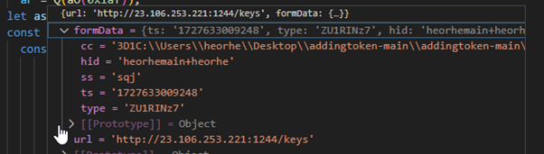

# About 
The attack primarily targets development companies with the aim of gaining initial access to their corporate infrastructure. The attack typically begins with a LinkedIn message posing as a legitimate development opportunity or business proposal. The message is designed to entice the recipient by offering a project or job, often tailored to the company's expertise. Once the recipient engages, attackers may attempt to gather information, deploy phishing links, or gain unauthorized access to critical systems, using this initial contact as a foothold into the company's network.

Links: 
- https://www.linkedin.com/in/merilyn-edeki/ still active ✅
- https://github.com/0xcestlaview/addingtoken removed ❌
- https://github.com/0xcompanypro/addingtoken still active ✅

## Process of Removing
- **27/09/2024**: Report submitted to the Microsoft Security Response Center (MSRC)
- **28/09/2024**: Received a response from MSRC stating, *"It does not meet Microsoft’s requirements as a security vulnerability for servicing."*
- **28/09/2024**: Contacted a friend from Microsoft, resulting in the malicious GitHub account being blocked. ✅
- **04/10/2024**: Attacker reached out again with a new GitHub repository shared.
- **04/10/2024**: Cotacted Microsoft again, but the new GitHub account remained active

# LinkedIn messages

The file, which is not malicious and contains the complete documentation and specifications for the project, can be found within the provided link or attachment. [ProjectOverviewforCestlavie](docs/ProjectOverviewforCestlavie.pdf) 

Upon sending the offer, the attackers request the recipient's GitHub account information, claiming that they will grant access to a repository where the project can be closely reviewed. 

When the invitation was received, the GitHub repository's homepage appeared quite convincing, with a professional layout and relevant project details. Additionally, the activity on the project, such as recent commits and contributions, seemed legitimate, further reinforcing the impression that it was a genuine opportunity

At a quick glance, reviewing the project code didn’t reveal any malicious content, so we suspected that the issue might be in the dependencies. However, when we couldn't find anything suspicious in the dependencies, we took a closer look at the code itself. That’s when we discovered something tricky. The entire GitHub project, including the malicious code, can be found in the repository. [AddingToken-main](files/addingtoken-main.zip)  (password: infected)

As seen in the image, we noticed that one file had something unusual on the far right side. When we used the word wrap command, it revealed the main juice.

And here’s where things get a lot more fun :). Deobfuscating the code didn’t reveal much, so we formatted the code and ran it through a debugger in the lab environment. That's when we discovered that the code connects to a specific server at `hxxtp://23.106.253.221:1244/keys` and posts certain data. As shown in the image, this connection provided further insight into the malicious activity

After this initial call, the code made a request to `hxxtp://23.106.253.221:1244/j/ZU1RINz7`, which returned a file named infected file. This file was then saved locally in the users home `.vscode` directory under the name `test.js`. The program continued by downloading another file, package.json, from `hxxtp://23.106.253.221:1244/p` and stored it in the same `.vscode` directory.  

Further debugging reveals that, later in the process, the code composes and executes three key commands. First, it installs the necessary npm dependencies by running `cd "C:\\Users\\heorhe\\.vscode" && npm i --silent"`. Once the dependencies are in place, it executes the same installation command again for redundancy or to ensure all packages are properly installed  `npm --prefix "C:\\Users\\heorhe\\.vscode" install`. After that, the program proceeds by running executing the program `node C:\\Users\\heorhe\\.vscode\test.js`, which executes the malicious `test.js` file downloaded earlier. This sequence of commands allows the malicious code to execute seamlessly under the guise of typical development activity, making it more difficult to detect in a development environment.

 

"We tested the downloaded malicious code with various antivirus programs to determine if it would be flagged as malicious. Surprisingly, we found that only 4 antivirus programs detected the code as suspicious. This low detection rate highlights the stealthy nature of the malware, allowing it to potentially bypass many security solutions and remain undetected on compromised systems.

 

The next action the program takes is downloading a Python executable binary, which it later uses for further malicious activities. Once the Python binary is downloaded, the program proceeds to run a Python scripts, leveraging the newly acquired binary to execute the malicious code. The associated files, including the Python binary and script, can be found in this project under [All files](files/infected_files.7z)  (password: infected).
 

Later on the scripts that are run on the machine are
1. script `.npl.py`
    original:
    
     
    
    decoded: 

     
2. In order to achieve its final objective, the program downloads `pay.py`, which contains a **reverse shell** designed to connect back to the attacker's machine, allowing remote control of the compromised system. Additionally, other files like `pay.txt` and `any.txt` are also downloaded, likely serving as configuration or supplementary files for the malicious activities

## Reverse shell code
 
 
 
 
 
 
 
 
 
 
 
 
 
 
 
 
 
 
 
 
 
 

